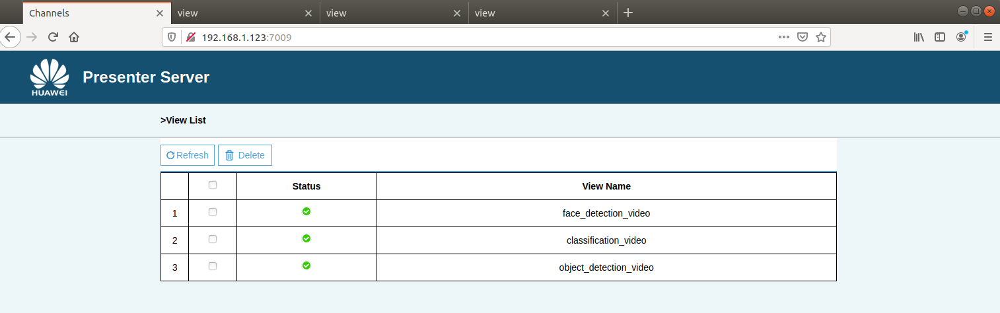

# multi-model-inferences

#### 介绍

本工程基于Atlas 200 DK进行多模型并行推理

基于Atlas 200 DK的多模型协同推理应用案例，该案例基于以下三个模型推理工程修改：

1、https://gitee.com/ascend/samples/tree/master/classification_video/for_atlas200dk_1.7x.0.0_c++

2、https://gitee.com/ascend/samples/tree/master/objectdetection_video/for_atlas200dk_1.7x.0.0_c++

3、https://gitee.com/yushanjin/facedetection

#### 运行效果

